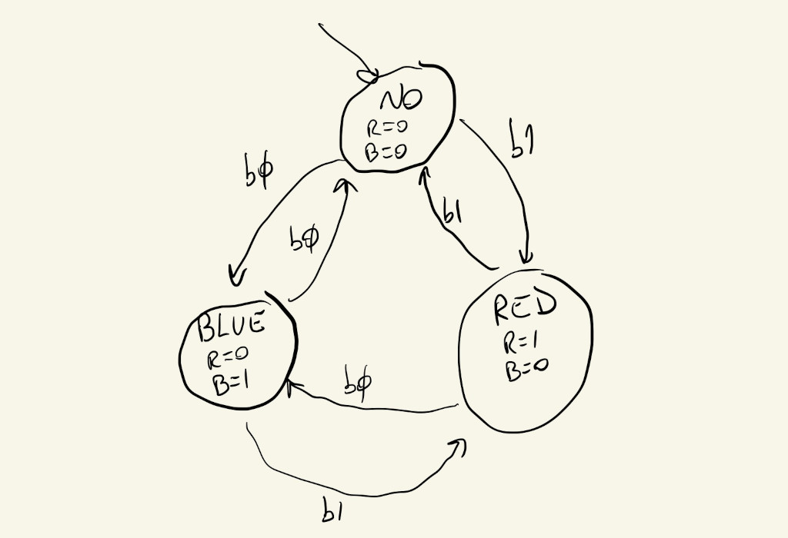
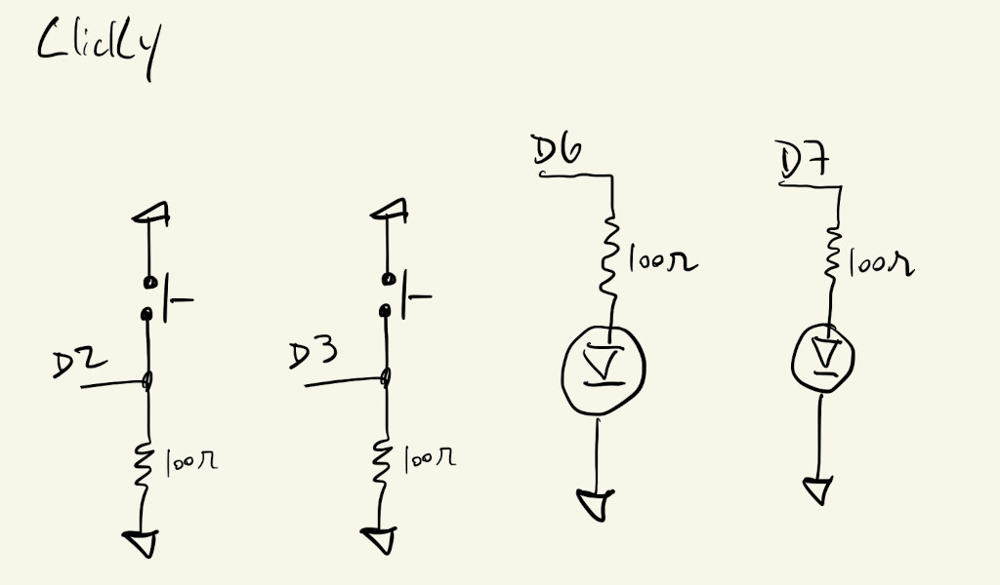
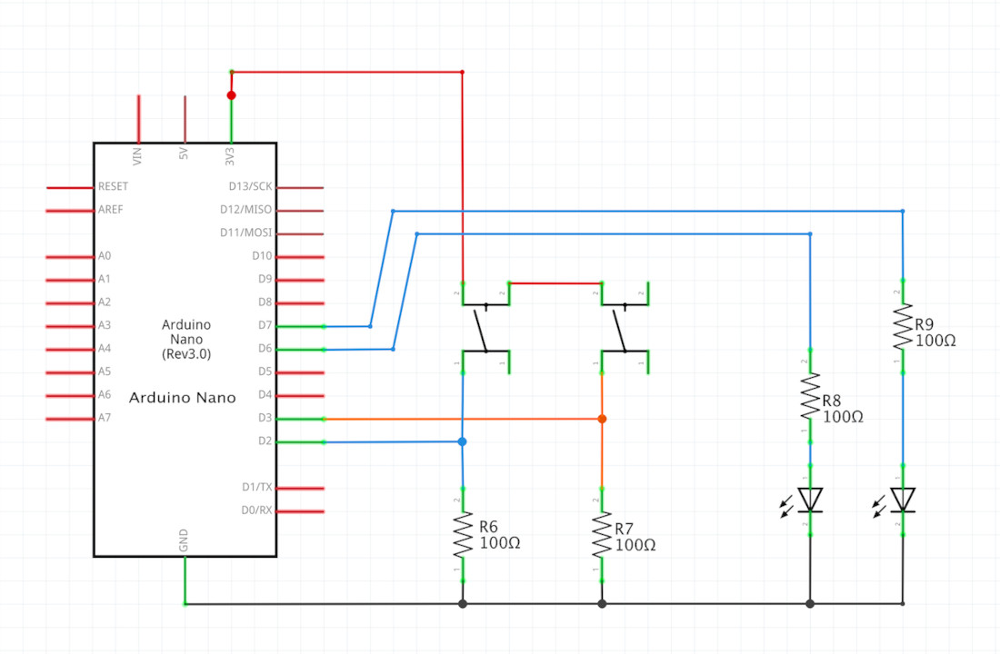
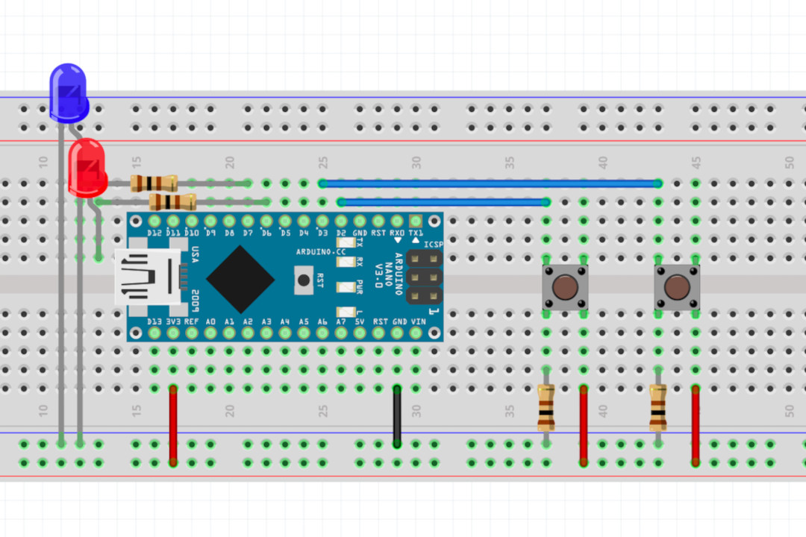

# HW11 : Clicky

Example of how to use the ```Clicky``` Class to help detect button/switch clicks.

Call ```Clicky.setup(pin)``` in ```setup()``` to set the pin, and then ```Clicky.wasClicked()``` in ```loop()``` to get a boolean that tells whether the button was clicked during the loop iteration.

```
Clicky mClick;

void setup() {
  mClick.setup(2);
}

void loop() {
  if (mClick.wasClicked()) {
    // button was clicked
    // switch state, set output, etc
  }
}
```


## Example

The code included in this repo uses the class to implement a system that toggles between three states.

- No Light State:
  - pressing B0 turns on blue light
  - pressing B1 turns on red light
- Blue Light State:
  - pressing B0 turn off all lights
  - pressing B1 turns on red light
- Red Light State:
  - pressing B0 turns on blue light
  - pressing B1 turn off all lights

### FSM diagram


### Drawing


### Schematic


### Board

